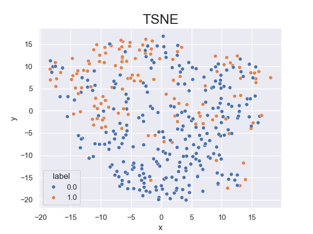

# Machine-Learning-Exam
# Diabetes Prediction using Machine Learning
- This project evaluates and compares binary classification models to predict diabetes producted by **Claudia Delprete, Valeriana Mancazzo, Pietro Marvulli, Simona Monfreda**
---

##  Dataset

- **Source**: [Kaggle – Pima Indians Diabetes Dataset](https://www.kaggle.com/code/abhikaggle8/pima-diabetes-classification)
- **Goal**: Predict whether a patient will develop diabetes.
- **Features**:
  `Pregnancies`,`Glucose`, `BloodPressure`, `SkinThickness`, `Insulin`, `BMI`, `DiabetesPedigreeFunction`, `Age`
- **Target**: `Outcome` (0 = No diabetes, 1 = Diabetes)

---

## Methods

### Data Preprocessing
- Replaced zero values with `NaN` in key medical features.
- Removed rows with `NaN`.
- Normalized data with `StandardScaler`.

### Feature Selection
- **Correlation matrix** with a threshold of `0.70` to evaluate redundant features.
- **Univariate feature selection** using F-test (ANOVA) with FPR threshold of `0.05`.

### Visualization
- **t-SNE** for 2D data visualization.
- **Correlation matrix** heatmap.
#### Correlation Matrix


#### t-SNE Projection



---

### Classification Models
All models were optimized with `GridSearchCV`:
- **Logistic Regression**
- **Decision Tree**
- **Support Vector Machine**

---

## Evaluation Metrics

- **AUC (Area Under Curve)**
- **Precision**
- **Recall**
- **F1-score**

---

## Results on Test Set

| Model               | AUC  | Precision | Recall | F1-score |
|--------------------|------|-----------|--------|----------|
| Logistic Regression| 0.84 |   0.81    |  0.74  |   0.77   |
| Decision Tree      | 0.75 |   0.68    |  0.71  |   0.69   |
| SVM                | 0.84 | **0.85**  | **0.76** | **0.80** |

---

## How to Run
### 1.  Clone the Repository
```bash
git clone https://github.com/PietroMarvulli/Machine-Learning-Exam.git
 ```
### 2.  Set Up Virtual Environment
```bash
python -m venv .venv
.\.venv\Scripts\activate
 ```
### 3. Install Requirements
```bash
pip install -r requirements.txt
 ```
### 4.  Run ```main.py```
```bash
python main.py
 ```

